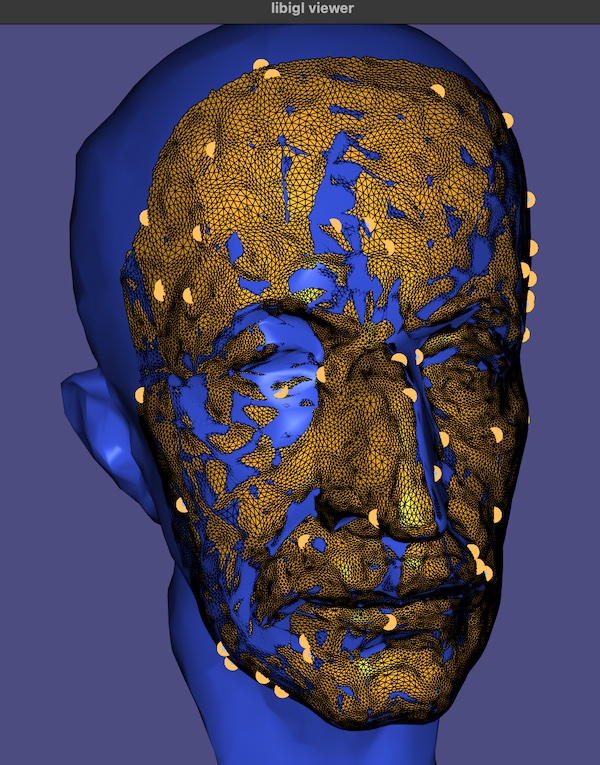

# My Geometry Processing — Registration Solution

> The starter code was cloned from
> 
>     git clone --recursive http://github.com/[username]/geometry-processing-registration.git
>

## Installation, Layout, and Compilation

See
[introduction](http://github.com/alecjacobson/geometry-processing-introduction).

## Execution

Once built, you can execute the assignment from inside the `build/` using 

    ./registration [path to mesh1.obj] [path to mesh2.obj]

## Point-to-Point rigid matching converges in directed Hausdorff distance. 
Below is also an image of one of the final iterations of the point-to-point ICP matching the facial mask surface 
to the target. 

```
D_{H}(X -> Y) >= 0.0847017
D_{H}(X -> Y) >= 0.0820178
D_{H}(X -> Y) >= 0.0569554
D_{H}(X -> Y) >= 0.0405036
D_{H}(X -> Y) >= 0.0359048
D_{H}(X -> Y) >= 0.0208481
D_{H}(X -> Y) >= 0.0166475
D_{H}(X -> Y) >= 0.0127516
D_{H}(X -> Y) >= 0.00630944
D_{H}(X -> Y) >= 0.00744634
D_{H}(X -> Y) >= 0.00599849
D_{H}(X -> Y) >= 0.00551476
D_{H}(X -> Y) >= 0.00338652
```


### Why is my code so slow?

Try profiling your code. Where is most of the computation time spent?

If you have done things right, the majority of time is spent computing
point-to-mesh distances. For each query point, the [computational
complexity](https://en.wikipedia.org/wiki/Computational_complexity_theory) of
computing its distance to a mesh with $m$ faces is $O(m)$.

This can be _dramatically_ improved (e.g., to $O(\log m)$ on average) using an
[space partitioning](https://en.wikipedia.org/wiki/Space_partitioning) data
structure such as a [kd tree](https://en.wikipedia.org/wiki/K-d_tree), a
[bounding volume
hierarchy](https://en.wikipedia.org/wiki/Bounding_volume_hierarchy), or
[spatial hash](https://en.wikipedia.org/wiki/Bin_(computational_geometry)).

You could follow [this assignment from our graphics course](https://github.com/alecjacobson/computer-graphics-bounding-volume-hierarchy) to learn how to implement an AABB tree.

